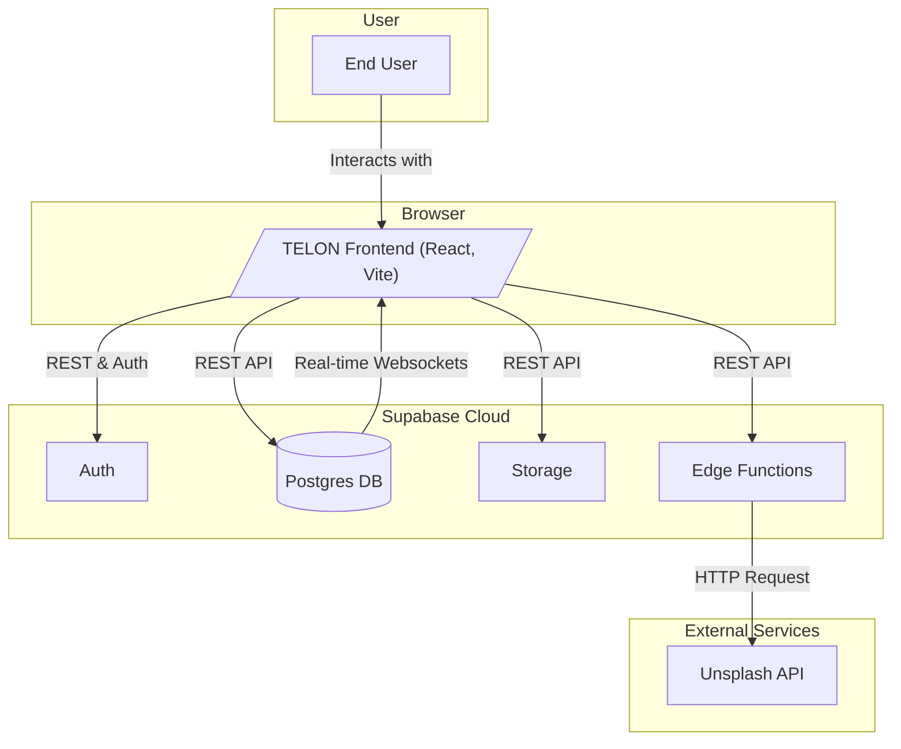
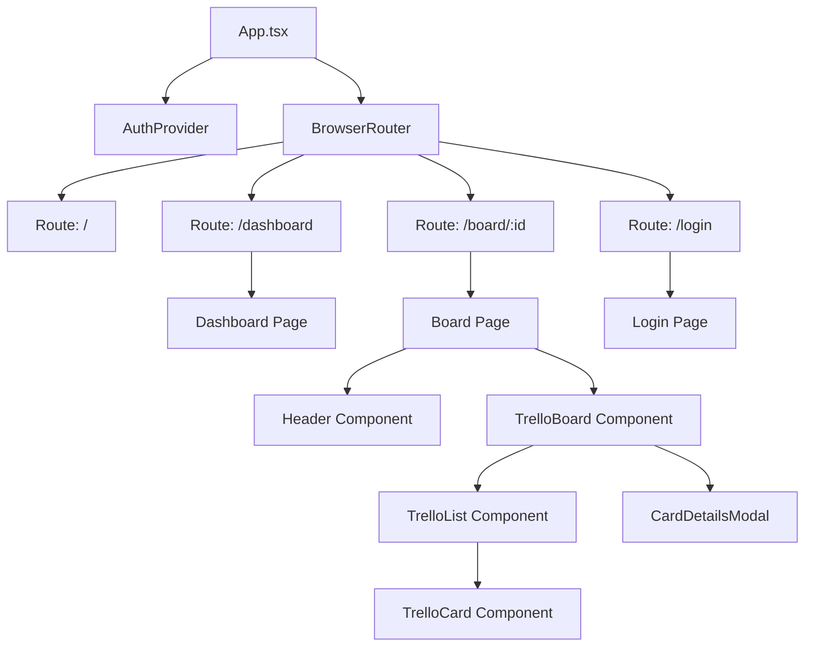
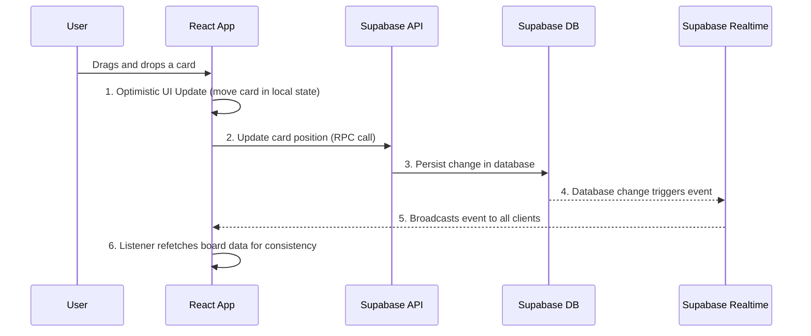

# TELON - A Real-Time Task Management Board

**TELON** is an open-source, feature-rich clone of Trello, built with a modern web stack including React, TypeScript, Vite, Tailwind CSS, and Supabase. It provides a real-time, collaborative, and interactive platform for managing tasks and projects.

<p align="center">
  
</p>

## Key Features

-   **Real-time Collaboration**: Changes made by one user are instantly visible to others via Supabase Realtime subscriptions.
-   **Drag & Drop**: Seamlessly reorder cards within and between lists using `@atlaskit/pragmatic-drag-and-drop`.
-   **Secure Authentication**: User login and management handled by Supabase Auth, with options for both email/password and public, no-account-needed boards.
-   **Rich Card Details**: Cards support descriptions, labels, checklists with progress bars, file attachments, due dates, and dynamic cover images.
-   **Card Relations**: Link cards together to show dependencies or related tasks.
-   **WIP Limits**: Set Work-In-Progress limits on lists to improve workflow.
-   **Dynamic Backgrounds**: Customize board backgrounds with solid colors, images from the Unsplash API, or your own custom uploads.
-   **Global Search**: A debounced search input allows you to quickly find cards across all your boards.
-   **Notifications**: Receive in-app notifications when you are invited to a board or mentioned in a comment.
-   **Team Management**: Invite users to boards and manage their roles.

---

## Tech Stack

-   **Frontend**: React, TypeScript, Vite
-   **Styling**: Tailwind CSS with shadcn/ui components
-   **Backend & Database**: Supabase (Auth, Postgres Database, Storage, Edge Functions)
-   **Routing**: React Router
-   **State Management**: `useState` / `useContext` for local state, with Supabase's real-time subscriptions keeping data fresh.
-   **Drag & Drop**: `@atlaskit/pragmatic-drag-and-drop`
-   **Testing**: Vitest & React Testing Library

---

## Diagrams

### Infrastructure



### Code Structure



### Data Flow (Real-time Update)



---

## Setup and Installation

Follow these steps to get the project running locally.

### Prerequisites

-   Node.js (v18 or later)
-   npm or yarn
-   A free [Supabase account](https://supabase.com/dashboard)

### 1. Backend Setup (Supabase)

1.  **Create a Supabase Project**:
    -   Go to the [Supabase Dashboard](https://supabase.com/dashboard) and click "New project".
    -   Give your project a name and a strong database password.
    -   Choose a region and click "Create project".

2.  **Get API Credentials**:
    -   In your new project's dashboard, navigate to **Project Settings** (the gear icon) > **API**.
    -   Find your **Project URL** and the **`anon` public key**. You will need these for the frontend setup.

3.  **Set up the Database Schema**:
    -   Navigate to the **SQL Editor** in the Supabase dashboard.
    -   Click **+ New query**.
    -   Copy the entire content of the SQL script below and paste it into the editor. This script will create all the necessary tables, functions, triggers, and security policies.
    -   Click **RUN**.

    ```sql
    -- 1. Create Tables

    CREATE TABLE public.users (
        id uuid NOT NULL PRIMARY KEY REFERENCES auth.users(id) ON DELETE CASCADE,
        full_name text,
        avatar_url text,
        email text
    );

    CREATE TABLE public.boards (
        id uuid PRIMARY KEY DEFAULT gen_random_uuid(),
        user_id uuid REFERENCES auth.users(id) ON DELETE SET NULL DEFAULT auth.uid(),
        name text NOT NULL,
        background_config jsonb,
        is_closed boolean NOT NULL DEFAULT false,
        created_at timestamp with time zone NOT NULL DEFAULT now(),
        last_viewed_at timestamp with time zone DEFAULT NULL
    );

    CREATE TABLE public.board_members (
        board_id uuid NOT NULL REFERENCES public.boards(id) ON DELETE CASCADE,
        user_id uuid NOT NULL REFERENCES auth.users(id) ON DELETE CASCADE,
        role text NOT NULL DEFAULT 'member',
        created_at timestamp with time zone DEFAULT now(),
        PRIMARY KEY (board_id, user_id)
    );

    CREATE TABLE public.lists (
        id uuid PRIMARY KEY DEFAULT gen_random_uuid(),
        board_id uuid NOT NULL REFERENCES public.boards(id) ON DELETE CASCADE,
        title text NOT NULL,
        position double precision NOT NULL,
        created_at timestamp with time zone NOT NULL DEFAULT now(),
        card_limit integer DEFAULT NULL
    );

    CREATE TABLE public.cards (
        id uuid PRIMARY KEY DEFAULT gen_random_uuid(),
        list_id uuid NOT NULL REFERENCES public.lists(id) ON DELETE CASCADE,
        content text NOT NULL,
        description text,
        position double precision NOT NULL,
        is_completed boolean NOT NULL DEFAULT false,
        cover_config jsonb,
        start_date timestamp with time zone,
        due_date timestamp with time zone,
        created_at timestamp with time zone NOT NULL DEFAULT now()
    );

    CREATE TABLE public.labels (
        id uuid PRIMARY KEY DEFAULT gen_random_uuid(),
        board_id uuid NOT NULL REFERENCES public.boards(id) ON DELETE CASCADE,
        name text,
        color text NOT NULL,
        created_at timestamp with time zone NOT NULL DEFAULT now()
    );

    CREATE TABLE public.card_labels (
        card_id uuid NOT NULL REFERENCES public.cards(id) ON DELETE CASCADE,
        label_id uuid NOT NULL REFERENCES public.labels(id) ON DELETE CASCADE,
        PRIMARY KEY (card_id, label_id)
    );

    CREATE TABLE public.card_comments (
        id uuid PRIMARY KEY DEFAULT gen_random_uuid(),
        card_id uuid NOT NULL REFERENCES public.cards(id) ON DELETE CASCADE,
        user_id uuid NOT NULL REFERENCES auth.users(id) ON DELETE CASCADE,
        content text NOT NULL,
        created_at timestamp with time zone NOT NULL DEFAULT now(),
        updated_at timestamp with time zone NOT NULL DEFAULT now()
    );

    CREATE TABLE public.checklists (
        id uuid PRIMARY KEY DEFAULT gen_random_uuid(),
        card_id uuid NOT NULL REFERENCES public.cards(id) ON DELETE CASCADE,
        title text NOT NULL,
        position double precision NOT NULL,
        created_at timestamp with time zone DEFAULT now()
    );

    CREATE TABLE public.checklist_items (
        id uuid PRIMARY KEY DEFAULT gen_random_uuid(),
        checklist_id uuid NOT NULL REFERENCES public.checklists(id) ON DELETE CASCADE,
        content text NOT NULL,
        is_completed boolean NOT NULL DEFAULT false,
        position double precision NOT NULL,
        created_at timestamp with time zone DEFAULT now()
    );

    CREATE TABLE public.card_attachments (
        id uuid PRIMARY KEY DEFAULT gen_random_uuid(),
        card_id uuid NOT NULL REFERENCES public.cards(id) ON DELETE CASCADE,
        file_path text NOT NULL,
        file_name text NOT NULL,
        file_type text,
        created_at timestamp with time zone DEFAULT now()
    );

    CREATE TABLE public.card_relations (
        card1_id uuid NOT NULL REFERENCES public.cards(id) ON DELETE CASCADE,
        card2_id uuid NOT NULL REFERENCES public.cards(id) ON DELETE CASCADE,
        PRIMARY KEY (card1_id, card2_id)
    );

    CREATE TABLE public.notifications (
        id uuid PRIMARY KEY DEFAULT gen_random_uuid(),
        user_id uuid NOT NULL REFERENCES auth.users(id) ON DELETE CASCADE,
        actor_id uuid REFERENCES auth.users(id) ON DELETE SET NULL,
        type text NOT NULL,
        data jsonb,
        is_read boolean NOT NULL DEFAULT false,
        created_at timestamp with time zone NOT NULL DEFAULT now()
    );

    -- 2. Create Helper Functions

    CREATE OR REPLACE FUNCTION public.handle_new_user()
    RETURNS trigger LANGUAGE plpgsql SECURITY DEFINER AS $$
    BEGIN
      INSERT INTO public.users (id, email, full_name, avatar_url)
      VALUES (NEW.id, NEW.email, NEW.raw_user_meta_data->>'full_name', NEW.raw_user_meta_data->>'avatar_url');
      RETURN NEW;
    END;
    $$;

    CREATE OR REPLACE FUNCTION public.add_board_creator_as_admin()
    RETURNS trigger LANGUAGE plpgsql SECURITY DEFINER SET search_path TO 'public' AS $$
    BEGIN
      IF NEW.user_id IS NOT NULL THEN
        INSERT INTO public.board_members (board_id, user_id, role)
        VALUES (NEW.id, NEW.user_id, 'admin');
      END IF;
      RETURN NEW;
    END;
    $$;

    CREATE OR REPLACE FUNCTION public.is_board_member(p_board_id uuid)
    RETURNS boolean LANGUAGE plpgsql SECURITY DEFINER AS $$
    BEGIN
      RETURN EXISTS (
        SELECT 1 FROM public.board_members bm
        WHERE bm.board_id = p_board_id AND bm.user_id = auth.uid()
      );
    END;
    $$;

    CREATE OR REPLACE FUNCTION public.is_board_admin(p_board_id uuid)
    RETURNS boolean LANGUAGE plpgsql SECURITY DEFINER SET search_path TO 'public' AS $$
    BEGIN
      RETURN EXISTS (
        SELECT 1 FROM board_members
        WHERE board_id = p_board_id AND user_id = auth.uid() AND role = 'admin'
      );
    END;
    $$;

    CREATE OR REPLACE FUNCTION public.is_board_public(p_board_id uuid)
    RETURNS boolean LANGUAGE plpgsql SECURITY DEFINER SET search_path TO 'public' AS $$
    BEGIN
      RETURN EXISTS (
        SELECT 1 FROM boards
        WHERE id = p_board_id AND user_id IS NULL
      );
    END;
    $$;

    -- 3. Create Triggers

    CREATE TRIGGER on_auth_user_created
      AFTER INSERT ON auth.users
      FOR EACH ROW EXECUTE FUNCTION public.handle_new_user();

    CREATE TRIGGER on_board_created
      AFTER INSERT ON public.boards
      FOR EACH ROW EXECUTE FUNCTION public.add_board_creator_as_admin();

    -- 4. Enable Row Level Security (RLS) on all tables
    ALTER TABLE public.users ENABLE ROW LEVEL SECURITY;
    ALTER TABLE public.boards ENABLE ROW LEVEL SECURITY;
    ALTER TABLE public.board_members ENABLE ROW LEVEL SECURITY;
    ALTER TABLE public.lists ENABLE ROW LEVEL SECURITY;
    ALTER TABLE public.cards ENABLE ROW LEVEL SECURITY;
    ALTER TABLE public.labels ENABLE ROW LEVEL SECURITY;
    ALTER TABLE public.card_labels ENABLE ROW LEVEL SECURITY;
    ALTER TABLE public.card_comments ENABLE ROW LEVEL SECURITY;
    ALTER TABLE public.checklists ENABLE ROW LEVEL SECURITY;
    ALTER TABLE public.checklist_items ENABLE ROW LEVEL SECURITY;
    ALTER TABLE public.card_attachments ENABLE ROW LEVEL SECURITY;
    ALTER TABLE public.card_relations ENABLE ROW LEVEL SECURITY;
    ALTER TABLE public.notifications ENABLE ROW LEVEL SECURITY;

    -- 5. Create RLS Policies

    -- Users Table
    CREATE POLICY "Public user data is viewable by everyone." ON public.users FOR SELECT USING (true);
    CREATE POLICY "Users can update their own data." ON public.users FOR UPDATE USING (auth.uid() = id);

    -- Boards Table
    CREATE POLICY "Users can create their own boards" ON public.boards FOR INSERT TO authenticated WITH CHECK (auth.uid() IS NOT NULL);
    CREATE POLICY "Allow viewing of public or member boards" ON public.boards FOR SELECT TO authenticated USING (user_id IS NULL OR (EXISTS (SELECT 1 FROM board_members WHERE board_members.board_id = boards.id AND board_members.user_id = auth.uid())));
    CREATE POLICY "Admins can update board" ON public.boards FOR UPDATE TO authenticated USING ((EXISTS (SELECT 1 FROM board_members WHERE board_members.board_id = boards.id AND board_members.user_id = auth.uid() AND board_members.role = 'admin')));
    CREATE POLICY "Admins can delete board" ON public.boards FOR DELETE TO authenticated USING ((EXISTS (SELECT 1 FROM board_members WHERE board_members.board_id = boards.id AND board_members.user_id = auth.uid() AND board_members.role = 'admin')));

    -- Board Members Table
    CREATE POLICY "Members can view other members" ON public.board_members FOR SELECT USING (is_board_member(board_id));
    CREATE POLICY "Admins can manage members" ON public.board_members FOR ALL USING (is_board_admin(board_id));

    -- Lists, Cards, and all related sub-tables
    CREATE POLICY "Members or public can manage lists" ON public.lists FOR ALL USING (is_board_member(board_id) OR is_board_public(board_id));
    CREATE POLICY "Members or public can manage cards" ON public.cards FOR ALL USING (is_board_member((SELECT l.board_id FROM lists l WHERE l.id = cards.list_id)) OR is_board_public((SELECT l.board_id FROM lists l WHERE l.id = cards.list_id)));
    CREATE POLICY "Members or public can manage labels" ON public.labels FOR ALL USING (is_board_member(board_id) OR is_board_public(board_id));
    CREATE POLICY "Members or public can manage card_labels" ON public.card_labels FOR ALL USING (is_board_member((SELECT l.board_id FROM cards c JOIN lists l ON c.list_id = l.id WHERE c.id = card_labels.card_id)) OR is_board_public((SELECT l.board_id FROM cards c JOIN lists l ON c.list_id = l.id WHERE c.id = card_labels.card_id)));
    CREATE POLICY "Members or public can manage checklists" ON public.checklists FOR ALL USING (is_board_member((SELECT l.board_id FROM cards c JOIN lists l ON c.list_id = l.id WHERE c.id = checklists.card_id)) OR is_board_public((SELECT l.board_id FROM cards c JOIN lists l ON c.list_id = l.id WHERE c.id = checklists.card_id)));
    CREATE POLICY "Members or public can manage checklist_items" ON public.checklist_items FOR ALL USING (is_board_member((SELECT l.board_id FROM checklist_items ci JOIN checklists cl ON ci.checklist_id = cl.id JOIN cards c ON cl.card_id = c.id JOIN lists l ON c.list_id = l.id WHERE ci.id = checklist_items.id)) OR is_board_public((SELECT l.board_id FROM checklist_items ci JOIN checklists cl ON ci.checklist_id = cl.id JOIN cards c ON cl.card_id = c.id JOIN lists l ON c.list_id = l.id WHERE ci.id = checklist_items.id)));
    CREATE POLICY "Members or public can manage attachments" ON public.card_attachments FOR ALL USING (is_board_member((SELECT l.board_id FROM cards c JOIN lists l ON c.list_id = l.id WHERE c.id = card_attachments.card_id)) OR is_board_public((SELECT l.board_id FROM cards c JOIN lists l ON c.list_id = l.id WHERE c.id = card_attachments.card_id)));
    CREATE POLICY "Members or public can manage relations" ON public.card_relations FOR ALL USING (is_board_member((SELECT l.board_id FROM cards c JOIN lists l ON c.list_id = l.id WHERE c.id = card_relations.card1_id)) OR is_board_public((SELECT l.board_id FROM cards c JOIN lists l ON c.list_id = l.id WHERE c.id = card_relations.card1_id)));

    -- Comments Table
    CREATE POLICY "Allow commenting on accessible cards" ON public.card_comments FOR INSERT WITH CHECK (is_board_member((SELECT l.board_id FROM cards c JOIN lists l ON c.list_id = l.id WHERE c.id = card_comments.card_id)) OR is_board_public((SELECT l.board_id FROM cards c JOIN lists l ON c.list_id = l.id WHERE c.id = card_comments.card_id)));
    CREATE POLICY "Allow viewing comments on accessible cards" ON public.card_comments FOR SELECT USING (is_board_member((SELECT l.board_id FROM cards c JOIN lists l ON c.list_id = l.id WHERE c.id = card_comments.card_id)) OR is_board_public((SELECT l.board_id FROM cards c JOIN lists l ON c.list_id = l.id WHERE c.id = card_comments.card_id)));
    CREATE POLICY "Users can update their own comments" ON public.card_comments FOR UPDATE USING (auth.uid() = user_id);
    CREATE POLICY "Users can delete their own comments" ON public.card_comments FOR DELETE USING (auth.uid() = user_id);

    -- Notifications Table
    CREATE POLICY "Users can view their own notifications" ON public.notifications FOR SELECT USING (auth.uid() = user_id);
    CREATE POLICY "Users can update their own notifications" ON public.notifications FOR UPDATE USING (auth.uid() = user_id);
    CREATE POLICY "Allow users to create notifications" ON public.notifications FOR INSERT WITH CHECK (true);
    ```

4.  **Create Storage Buckets**:
    -   You must do this manually in the Supabase Dashboard under the **Storage** section.
    -   Create a bucket named `board-backgrounds` with public access.
    -   Create a bucket named `card-attachments` with public access.
    -   Create a bucket named `card-covers` with public access.
    -   Create a bucket named `avatars` with public access.
    -   *For production, you would want to set up proper RLS policies on these buckets instead of making them fully public.*

5.  **Set up Environment Variables for Edge Functions**:
    -   This project uses an Edge Function to search the Unsplash API. You need to provide it with an API key.
    -   Go to [Unsplash Developers](https://unsplash.com/developers) and create an account/app to get an access key.
    -   In your Supabase project dashboard, go to **Edge Functions** > **(select your project)** > **Settings** > **Add new secret**.
    -   Create a secret named `UNSPLASH_ACCESS_KEY` and paste your Unsplash access key as the value.

### 2. Frontend Setup

1.  **Clone the Repository**:
    ```bash
    git clone <repository-url>
    cd <repository-directory>
    ```

2.  **Install Dependencies**:
    ```bash
    npm install
    ```

3.  **Create Environment File**:
    -   Create a file named `.env` in the root of the project.
    -   Add your Supabase API credentials to it:
    ```
    VITE_SUPABASE_URL="YOUR_SUPABASE_PROJECT_URL"
    VITE_SUPABASE_ANON_KEY="YOUR_SUPABASE_ANON_KEY"
    ```
    -   Replace the placeholder values with the ones you copied from your Supabase project settings.

4.  **Run the Development Server**:
    ```bash
    npm run dev
    ```
    -   The application should now be running on `http://localhost:8080`.

---

## How to Develop

This project is structured to be easy to extend.

-   **Adding a New Component**: Create new `.tsx` files in `src/components`. If it's a general UI element, put it in `src/components/ui`. If it's specific to the Trello functionality, use `src/components/trello`.
-   **Adding a New Page**: Create a new page component in `src/pages` and add the route to `src/App.tsx`.
-   **Interacting with Supabase**: The Supabase client is initialized in `src/integrations/supabase/client.ts` and can be imported anywhere in the application. Use it to query your database, manage authentication, or call Edge Functions.
-   **Styling**: Use Tailwind CSS utility classes directly in your components for styling.
-   **Running Tests**: To run the test suite, use the command:
    ```bash
    npm test
    ```

Enjoy building!